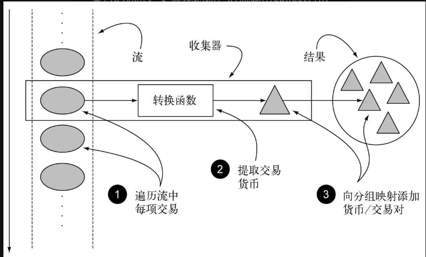
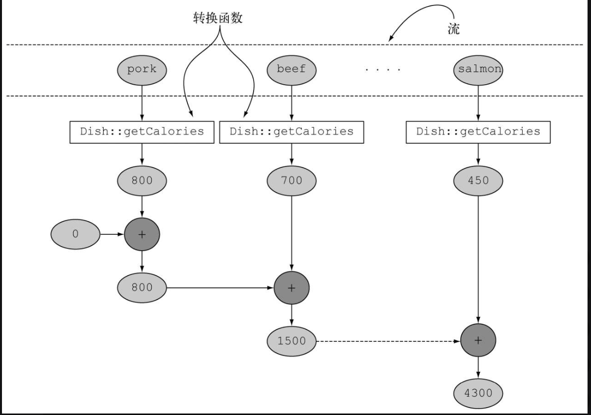
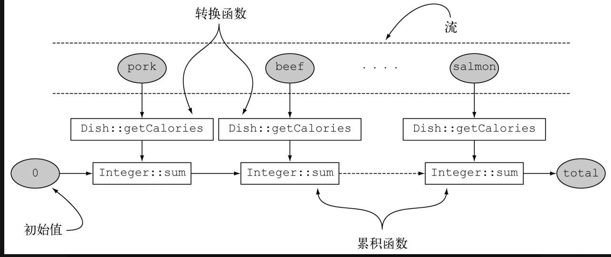

### 6.1.1 收集器用作高级归约

刚刚的结论又引出了优秀的函数式API设计的另一个好处：更易复合和重用。收集器非常有用，因为用它
可以简洁而灵活的定义collect用来生成结果集和的标准。
更具体来说，对流调用collect方法将对流中的元素触发一个归约操作（由Collector来参数化）

一般来说，Collector会对每一个元素应用一个转换函数（很多是不体现任何效果的恒等转换，例如toList),
并将结果集累积到一个数据结构中，从而产生这一个过程的最终输出。

### 6.1.2 预定义收集器

主要探讨预定义收集器的功能，也就是那些可以从Collectors类提供的工厂方法（例如groupingBy)创建的收集器
。
它们主要提供了三大功能：
1.将流元素归约和汇总为一个值
2.元素分组
3.元素分区

#### 归约和汇总

但凡要把流中的项目合并为一个结果时就可以使用收集器（Stream方法collect的参数）。
这个结果可以是任意的类型。

##### 查找流中的最大值和最小值

假设你想要找出菜单中热量最高的菜。你可以使用两个收集器，Collectors.maxBy和Collectors.minBy,来计算
流中的最大值和最小值。
这两个收集器接收一个Comparator参数来比较流中的元素。你可以创建一个Comparator来根据所含热量对菜肴
进行比较，并把它传递给Collectors.maxBy:

```java
Comparator<Dish> dishComparator=Comparator.comparingInt(Dish::getCalories);
        Optional<Dish> maxValue=menu.stream().collect(maxBy(dishComparator));
```

你可能在想Optional<Dish>是怎么回事。要回答这个问题，我们需要问“要是menu为空怎么办”。那就没有必要返回菜了。
Java8引入了Optional，它是一个容器，可以包含也可以不包含值。这里它完美地代表了可能不返回值的情况。

### 6.2.2 汇总

Collectors类专门为汇总提供了一个工厂方法:Collectors.summingInt.它可接受一个把对象映射为求和所需int的函数
，并返回一个收集器。该收集器在传递给普通的collect方法后即执行我们需要的函数。
例子：求出列表所需要的总热量。

```java
int total=menu.stream().collect(summingInt(Dish::getCalories));
```


在遍历流时，会把每一道菜都映射为其热量，然后把这个数字累加到一个累加器（这里的初始值为0）。
Collectors.summingLong和Collectors.summingDouble是一样的。

但汇总不仅是求和，还有Collectors.averagingInt,Collectors.averagingLong等。

不过在很多时候，你希望只进行一次操作就可以完成基本的汇总操作。可以使用Collectors.summarizing工厂方法
返回最大值，最小值，平均值。。。

### 6.2.3连接字符串

joining工厂方法返回的收集器会把对流中每一个对象应用toString方法得到的所有字符串连接成一个字符串。

```java
String menuName=menu.stream().map(Dish::getName).collect(Collectors.joining())
```

请注意，joining在内部使用了StringBuilder来把生成的字符串逐个追加起来。此外还需要注意，如果Dish类
有一个toString方法来返回菜肴的名称，那你无须提取每一道菜名的函数对原流做映射就能够得到相同的结果：

```java
menu.stream().collect(Collectors.joining())
```

joining工厂方法的重载：

```java
  joining(String splict); //接受一个分隔符
```

### 6.2.4 广义的归约汇总

事实上，我们讨论的所有收集器，都是可以用一个reducing工厂方法定义的归约过程的特殊情况而已。`Collectors.reducing`
工厂方法是所有这些特殊情况的一般化。
例如，可以使用reducing方法创建的收集器来计算你菜单的总热量：

```java
int total=menu.stream().collect(reducing(0,Dish::getCalories,(i,j)->i+j));
```

它需要三个参数

- 第一个参数为归约操作的初始值。 初始值
- 第二个参数为流映射的函数。 转换函数
- 第三个参数是一个BinaryOperator,也就是归约的映射函数。 累积函数
  

(单参数的reducing)求出热量最高的菜

```java
menu.stream().collect(reducing((d1,d2)->d1.getCalories()>d2.getCalories?d1:d2));
```

> 我们的collectors的收集器似乎都可以通过reducing实现，但是值得注意的是reducing是一个不可变的归约。
> 不能改变内部的累加器。如果改变，就不适应于并行操作。

实际上Collectors的收集器实现就是通过reducing封装的，如Collectors的counting收集器

```java
public static<T> Collector<T,?, Long> counting(){
        return reducing(0L,e->1L,Long::sum)
        }
```

> 泛型?,在这里它表示累加器的类型未知，它可以是任何类型。

#### 不同的方法执行同样的操作

我们可以使用map-reduce实现对Dish热量求和的同样操作，但是它的返回对象类型为Optional.

#### 根据情况选择最佳的解决方案

我们对求和使用map-reduce方案，因为它简单易读，而且它避免了“自动拆箱”操作。

