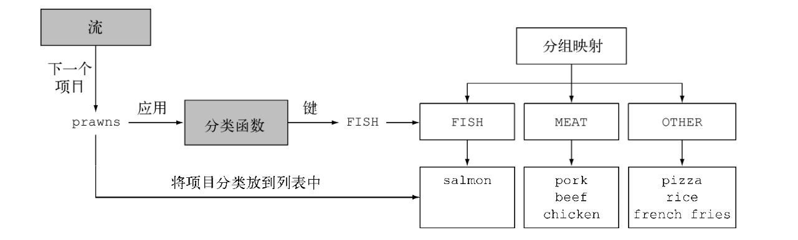
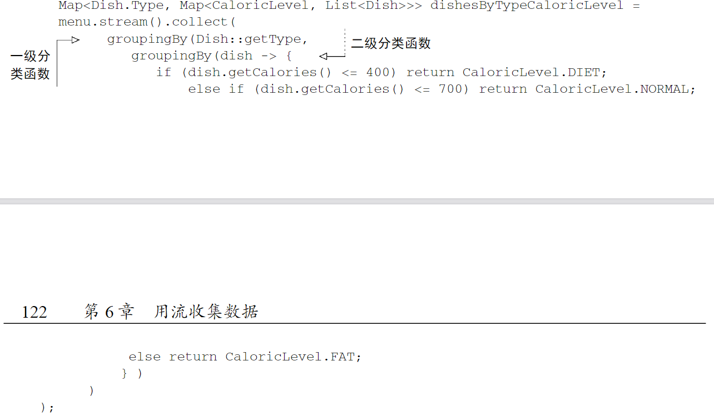
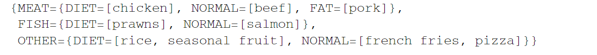
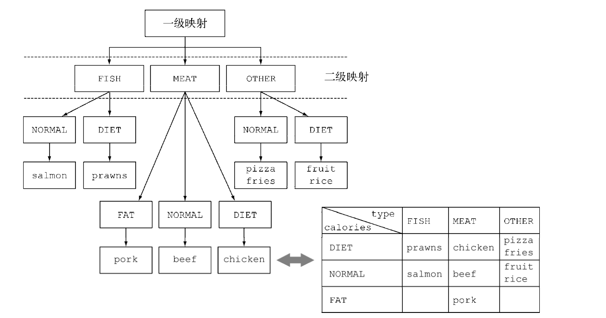
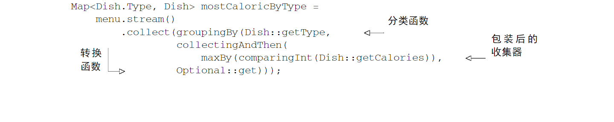
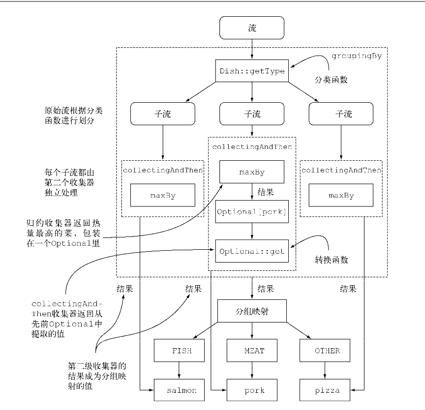
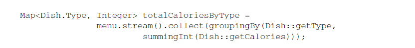
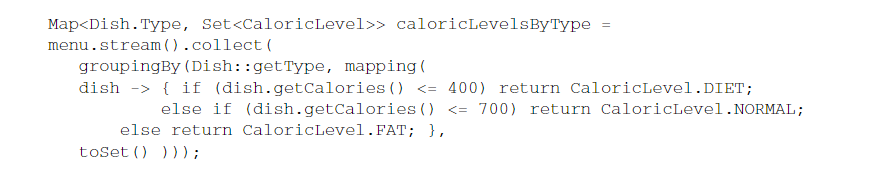
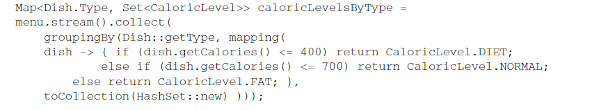

## 6.3 分组

一个常见的数据库操作是根据一个或多个属性对集合中的项目进行分组。就像前面讲到按货币对交易进行分组的例子一样，如果用指令式风格来实现的话，这个操作可能会很麻烦、啰嗦而且容易出错。
但是，如果用Java 8所推崇的函数式风格来重写的话，就很容易转化为一个非常容易看懂的语句。我们来看看这个功能的第二个例子：假设你要把菜单中的菜按照类型进行分类，有肉的放一组，有鱼的放一组，其他的都放另一组。
用Collectors.groupingBy工厂方法返回的收集器就可以轻松地完成这项任务，如下所示：

```java
Map<Dish.Type,List<Dish>>dishesByType=menu.stream().collect(groupingBy(Dish::getType));
```

其结果是下面的Map：

```java
{FISH=[prawns,salmon],OTHER=[french fries,rice,season fruit,pizza],MEAT=[pork,beef,chicken]}
```

这里，你给groupingBy方法传递了一个Function（以方法引用的形式），它提取了流中每一道Dish的Dish.Type。
我们把这个Function叫作分类函数，因为它用来把流中的元素分成不同的组。

分组操作的结果是一个Map，把分组函数返回的值作为映射的键，把流中所有具有这个分类值的项目的列表作为对应的映射值。
在菜单分类的例子中，键就是菜的类型，值就是包含所有对应类型的菜肴的列表。图6-4
在分组过程中对流中的项目进行分类但是，分类函数不一定像方法引用那样可用，因为你想用以分类的条件可能比简单的属性访问器要复杂。例如，你可能想把热量不到400卡路里的菜划分为“低热量”（diet），热量400到700卡路里的菜划为“普通”（normal），高于700卡路里的划为“高热量”（fat）。由于Dish类的作者没有把这个操作写成一个方法，你无法使用方法引用，但你可以把这个逻辑写成Lambda表达式：public
enum CaloricLevel { DIET, NORMAL, FAT } Map<CaloricLevel, List<Dish>> dishesByCaloricLevel = menu.stream().collect(
groupingBy(dish -> { if (dish.getCalories() <= 400) return CaloricLevel.DIET; else if (dish.getCalories() <= 700) return
CaloricLevel.NORMAL; else return CaloricLevel.FAT; } ));
现在，你已经看到了如何对菜单中的菜肴按照类型和热量进行分组，但要是想同时按照这两个标准分类怎么办呢？分组的强大之处就在于它可以有效地组合。让我们来看看怎么做。6.3.1
多级分组要实现多级分组，我们可以使用一个由双参数版本的Collectors.groupingBy工厂方法创建的收集器，它除了普通的分类函数之外，还可以接受collector类型的第二个参数。那么要进行二级分组的话，我们可以把一个内层groupingBy传递给外层groupingBy，并定义一个为流中项目分类的二级标准，如代码清单6-2所示。代码清单6-2
多级分组Map<Dish.Type, Map<CaloricLevel, List<Dish>>> dishesByTypeCaloricLevel = menu.stream().collect(
groupingBy(Dish::getType, groupingBy(dish -> { if (dish.getCalories() <= 400) return CaloricLevel.DIET; else if (
dish.getCalories() <= 700) return CaloricLevel.NORMAL; 一级分类函数二级分类函数

但是，分类函数不一定像方法引用那样可用，因为你想用以分类的条件可能比简单的属性访问器要复杂。

例如，你可能想把热量不到400卡路里的菜划分为“低热量”（diet），热量400到700卡路里的菜划为“普通”（normal），高于700卡路里的划为“高热量”（fat）。

由于Dish类的作者没有把这个操作写成一个方法，你无法使用方法引用，但你可以把这个逻辑写成Lambda表达式：

```java
{

public enum CaloricLevel {DIET, NORMAL, FAT};

Map<CaloricLevel, List<Dish>>dishesByCaloricLevel=menu.stream().collect(
        groupingBy(dish->{
        if(dish.getCalories()<=400)return CaloricLevel.DIET;
        else if(dish.getCalories()<=700)return CaloricLevel.NORMAL;
        else return CaloricLevel.FAT;}));
        }
```

现在，你已经看到了如何对菜单中的菜肴按照类型和热量进行分组，但要是想同时按照这两个标准分类怎么办呢？分组的强大之处就在于它可以有效地组合。让我们来看看怎么做

### 多级分组

要实现多级分组，我们可以使用一个由双参数版本的Collectors.groupingBy工厂方法创建的收集器，
它除了普通的分类函数之外，还可以接受collector类型的第二个参数。
那么要进行二级分组的话，我们可以把一个内层groupingBy传递给外层groupingBy，
并定义一个为流中项目分类的二级标准.


这个二级分组的结果就是像下面这样的两级Map：


这里的外层Map的键就是第一级分类函数生成的值：“fish, meat, other”，
而这个Map的值又是一个Map，键是二级分类函数生成的值：“normal, diet, fat”.
。最后，第二级map的值是流中元素构成的List，是分别应用第一级和第二级分类函数所得到的对应第一级和第二级键的值：“salmon、pizza...”
这种多级分组操作可以扩展至任意层级，n级分组就会得到一个代表n级树形结构的n级Map。

一般来说，把groupingBy看作“桶”比较容易明白。第一个groupingBy给每个键建立了一个桶。
然后再用下游的收集器去收集每个桶中的元素，以此得到n级分组。


### 按子组收集数据

在上一节中，我们看到可以把第二个groupingBy收集器传递给外层收集器来实现多级分组。
但进一步说，传递给第一个groupingBy的第二个收集器可以是任何类型，而不一定是另一 个groupingBy。
例如，要数一数菜单中每类菜有多少个，可以传递counting收集器作为groupingBy收集器的第二个参数：

```java
Map<Dish.Type,Long>typesCount=menu.stream().collect(
        groupingBy(Dish::getType,counting()));
```

其结果是下面的Map：{MEAT=3, FISH=2, OTHER=4}

还要注意，普通的单参数groupingBy(f)（其中f是分类函数）实际上是groupingBy(f, toList())的简便写法。
再举一个例子，你可以把前面用于查找菜单中热量最高的菜肴的收集器改一改，按照菜的类型分类：

```java
Map<Dish.Type,Optional<Dish>>mostCaloricByType=
        menu.stream().collect(groupingBy(Dish::getType,
        maxBy(comparingInt(Dish::getCalories))));
```

这个分组的结果显然是一个map，以Dish的类型作为键，以包装了该类型中热量最高的Dish的Optional<Dish>作为值：
{FISH=Optional[salmon], OTHER=Optional[pizza], MEAT=Optional[pork]}

#### 1. 把收集器的结果转换为另一种类型

因为分组操作的Map结果中的每个值上包装的Optional没什么用，所以你可能想要把它们去掉。

要做到这一点，或者更一般地来说，把收集器返回的结果转换为另一种类型，
你可以使用Collectors.collectingAndThen工厂方法返回的收集器，如下所示。



这个工厂方法`collectinngAndThen(maxBy(comparingInt(Dish::getCalories)),optional::get)));`
接受两个参数：一个是要转换的收集器，一个是转换函数。

下面是这个函数做到的一些操作：


- 收集器用虚线表示，因此groupingBy是最外层，根据菜肴的类型把菜单流分组，得到三个子流。
- groupingBy收集器包裹着collectingAndThen收集器，因此分组操作得到的每个子流都用这第二个收集器做进一步的归约
- collectingAndThen收集器又包裹着第三个收集器maxBy
- 随后由归约收集器进行子流的归约操作，然后包含它的collectingAndThen收集器会对其结果应用Optional:get转换函数
  对三个子流分别执行这一过程并转换而得到的三个值，也就是各个类型中热量最高的Dish,将成为
  groupingBy收集器返回的Map中与各个分类键(Dish的类型)相关联的值。

#### 与groupingBy联合使用的其他收集器的例子

一般来说，通过groupingBy工厂方法的第二个参数传递的收集器将会对分到同一组中的所有流元素
执行进一步归约操作。例如，你还重用求出所有菜肴热量总和的收集器，不过这次是对每一组Dish
求和:

然而常常和groupingBy联合使用的另一个收集器是mapping方法生成的。这个方法接受两个参数：
一个函数对流中的元素做变换，另一个则将变换的结果对象收集起来。其目的是在累加之前对每个
输入元素应用一个映射函数，这样就可以让接受特定类型元素的收集器适应不同类型的对象。
我们来看一个使用这个收集器的实际例子。比方说你想要知道，对于每种类型的Dish,菜单中都有哪些
CaloricLevel。我们可以把groupingBy和mapping收集器结合起来，如下所示:

这里，就像我们前面见到过的，传递给映射方法的转换函数将Dish映射成了它的CaloricLevel:
生成的CaloricLevel流传递给一个toSet收集器，它和toList类似，不过是把流中的元素累积到一个Set而不是List中，以便仅保留各不相同的值。
先前的示例所示，这个映射收集器将会收集分组函数生成的各个子流中的元素，让你得到这样的Map结果：
{OTHER=[DIET, NORMAL], MEAT=[DIET, NORMAL, FAT], FISH=[DIET, NORMAL]}
由此你就可以轻松地做出选择了。如果你想吃鱼并且在减肥，那很容易找到一道菜；同样，如果你饥肠辘辘，想要很多热量的话，菜单中肉类部分就可以满足你的饕餮之欲了。
请注意在上一个示例中，对于返回的Set是什么类型并没有任何保证。
但通过使用toCollection，你就可以有更多的控制。例如，你可以给它传递一个构造函数引用来要求HashSet：


